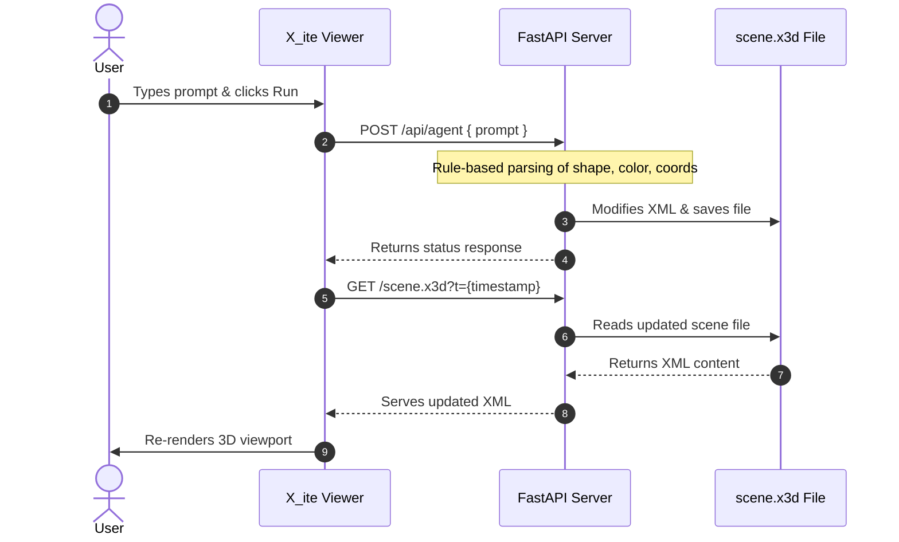

## Installation & Initialization

Follow these steps to set up and run the environment locally or inside a GitHub Codespace.

### 1. Prerequisites
Ensure you have Python 3.8+ installed along with `pip`.

### 2. Install Dependencies
Run the following command to install the required web framework packages:

```bash
pip install fastapi uvicorn pydantic
```

```bash
uvicorn app:app --host 0.0.0.0 --port 8000 --reload
```

# X3D Agent

A lightweight bridge between natural language instructions and X3D 3D scenes. This project allows you to modify 3D environments dynamically using conversational prompts, running directly in GitHub Codespaces.

## Architecture

The system uses a FastAPI backend to process natural language via rule-based regex parsing, and mutates an underlying `.x3d` file. The X3D scene is rendered in the browser using the X_ite viewer.



## Endpoints

| Method | Path | Description |
|--------|------|-------------|
| `GET` | `/` | Serves the HTML viewer UI |
| `GET` | `/scene.x3d` | Serves the current X3D scene file |
| `POST` | `/api/agent` | Accepts a `{ prompt }` body and mutates the scene |
| `POST` | `/api/clear` | Resets the scene to its default state |

## Notes

- The `scene.x3d` file is auto-created on startup if it does not exist.
- Natural language parsing is **rule-based** (regex + lookup tables) — no LLM or AI framework is used.
- Supported commands include adding shapes (`add a red sphere to the left`), removing the last shape (`undo`), and clearing the scene (`clear`).
