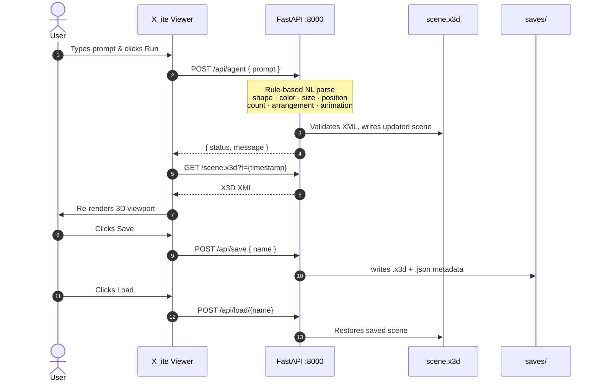
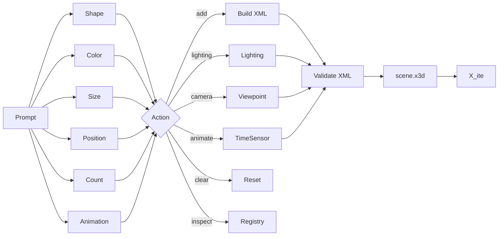
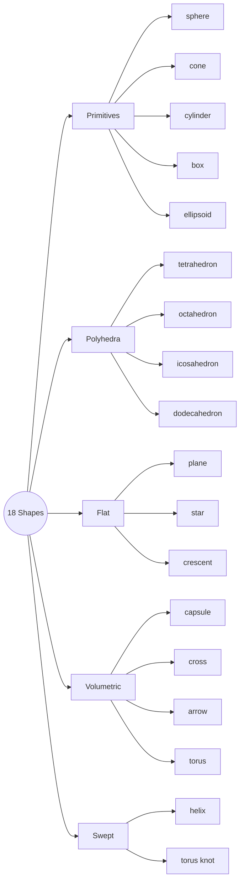
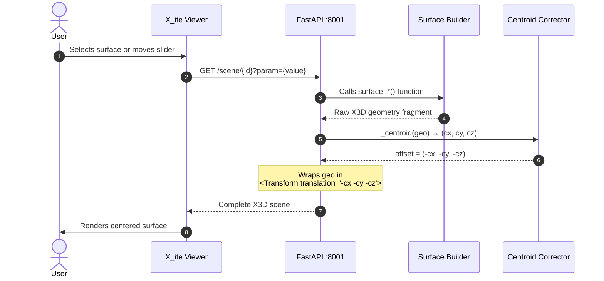
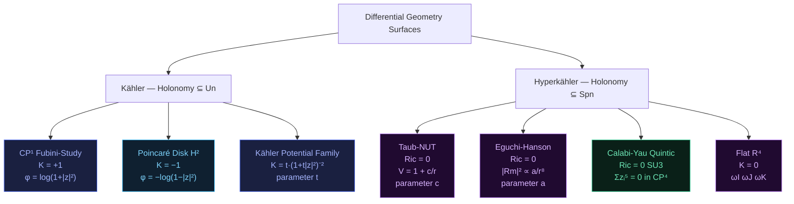

# X3D Studio

Two FastAPI apps for building and exploring 3D geometry in the browser, both rendered via [X_ite](https://create3000.github.io/x_ite/) (X3D WebGL engine). Run them side by side in a GitHub Codespace — each gets its own port and browser tab.

| App | File | Port | What it does |
|-----|------|------|--------------|
| X3D Agent | `app.py` | 8000 | Natural language 3D scene builder |
| Kähler Viewer | `kahler_viewer.py` | 8001 | Interactive differential geometry explorer |

---

## Installation

```bash
pip install fastapi uvicorn pydantic
```

```bash
# Terminal 1
uvicorn app:app --host 0.0.0.0 --port 8000 --reload

# Terminal 2
uvicorn kahler_viewer:app --host 0.0.0.0 --port 8001 --reload
```

In a GitHub Codespace both ports appear in the **Ports** tab and open in separate browser tabs.

---

## X3D Agent (`app.py`)

A rule-based natural language interface for building and exploring live X3D scenes. Type a command; the parser converts it to X3D geometry and serves it instantly.

### Architecture



### Parser pipeline



### Endpoints

| Method | Path | Description |
|--------|------|-------------|
| `GET` | `/` | Viewer UI |
| `GET` | `/scene.x3d` | Current X3D scene |
| `POST` | `/api/agent` | `{ prompt }` → mutates scene |
| `POST` | `/api/clear` | Reset to empty scene |
| `GET` | `/api/inspect` | List objects in scene |
| `POST` | `/api/save` | Save scene as `{ name }` |
| `POST` | `/api/load/{name}` | Load saved scene |
| `GET` | `/api/saves` | List saved scene names |

### Shapes

18 solid geometry types — all with verified face windings, correct normals, and smooth shading:



### What you can say

**Shapes**
```
add a red sphere to the left
spawn a huge gold torus in the center
place a silver capsule far right
add a neon blue torus knot below
drop a tilted orange arrow in front
add a cyan crescent above
spawn a jade dodecahedron
put a white plane below
```

**Colors** — 60+ named, two-word combos, hex, RGB:
```
rose gold · neon green · dark blue · electric cyan
#ff6600
color 255 128 0
transparent · glass · ghost
```

**Sizes**
```
tiny · small · medium · large · huge · massive · colossal
size 2.5 · radius 1.0
```

**Positions**
```
to the left · right · above · below · in front · behind
top left · bottom right · far above · underground · floating
at 2 3 -1
```

**Multi-shape**
```
add 5 red spheres in a row
spawn 8 blue cubes in a circle
create 6 gold stars in a grid
place 4 cyan cones scattered
```

**Lighting**
```
day · night · sunrise · neon · brighter · dimmer · add spotlight
```

**Camera**
```
reset camera · top view · front view · side view · isometric · zoom in · zoom out
```

**Animation** — applied to last object, or inline on add:
```
spin · bounce · pulse · stop
add a spinning red sphere
```

**Scene**
```
what's in the scene? · inventory · how many objects?
undo · clear · new scene
load hello · load fog · load text
```

### UI tabs

- **Console** — command log, auto-focuses after each run
- **Chips** — grouped shortcut buttons (Shapes, Multi, Animation, Lighting, Camera, Archive, Scene)
- **Saves** — name and persist scenes; reload any saved scene

### Notes

- Parsing is **rule-based regex** — no LLM required
- Corrupt `scene.x3d` auto-recovers to default on next command
- Saves persist as `.x3d` + `.json` in `saves/`
- Archive import fetches live from `web3d.org` (requires internet)
- Spotlight capped at 3; size clamped to `[0.05, 5.0]`; RGB clamped to `[0.0, 1.0]`
- Rendered via X_ite 16.1.2

---

## Kähler / Hyperkähler Viewer (`kahler_viewer.py`)

An interactive browser for differential-geometric surfaces from Kähler and hyperkähler geometry. Surfaces are colored by curvature using a spectral heatmap: **blue = negative · green = zero / Ricci-flat · orange = positive**.

### Architecture



### Surface taxonomy



### Surfaces

**Kähler manifolds** — holonomy ⊆ U(1)

| Surface | Kähler potential φ | Curvature | Holonomy | Parameter |
|---------|-------------------|-----------|----------|-----------|
| CP¹ Fubini-Study | log(1 + \|z\|²) | K = +1 | U(1) | — |
| Poincaré Disk H² | −log(1 − \|z\|²) | K = −1 | U(1) | — |
| Kähler Potential Family | t⁻¹ log(1 + t\|z\|²) | K(z) = t(1+t\|z\|²)⁻² | U(1) | t |

**Hyperkähler manifolds** — holonomy ⊆ Sp(1), Ricci-flat

| Surface | Metric / equation | \|Rm\|² | Holonomy | Parameter |
|---------|------------------|---------|----------|-----------|
| Taub-NUT | V(r) = 1 + c/r | decays as r⁻⁴ | Sp(1) ≅ SU(2) | c (NUT charge) |
| Eguchi-Hanson | f² = 1 − (a/r)⁴ | ∝ (a/r)⁸ | Sp(1) | a (bolt radius) |
| CY Quintic (slice) | Σᵢ zᵢ⁵ = 0 ⊂ CP⁴ | — | SU(3) | — |
| Flat ℝ⁴ | ωI, ωJ, ωK | 0 | Sp(1) ⊂ SO(4) | — |

### Endpoints

| Method | Path | Description |
|--------|------|-------------|
| `GET` | `/` | Viewer UI |
| `GET` | `/scene/{surface_id}?param=1.0` | X3D scene for given surface |
| `GET` | `/surfaces` | JSON index of all surfaces |

### Surface IDs

```
fubini_study    poincare    potential_family
taub_nut        eguchi_hanson    cy_quintic    hk_flat
```

### UI

- **Surfaces tab** — tap any surface to load it; KÄHLER / HYPERKÄHLER buttons in the header filter the list
- **Info tab** — Kähler potential, curvature, holonomy group, geometric description
- **Parameter tab** — live slider for surfaces that have one; updates on drag with 150ms debounce
- Curvature colormap strip at the bottom of the Surfaces tab: blue → green → orange

### Centering

Every surface is automatically centered at the origin by computing the mean of all coordinate points in the generated X3D fragment and injecting the negated centroid as the outer `<Transform translation>`. This runs on every request, so parametric surfaces stay centered as their slider value changes.

### References

- Huybrechts, *Complex Geometry* — Kähler manifolds and Hodge theory
- Joyce, *Compact Manifolds with Special Holonomy* — hyperkähler and Calabi-Yau
- Eguchi & Hanson (1978), *Asymptotically flat self-dual solutions to Euclidean gravity*
- Taub (1951), Newman, Unti & Tamburino (1963) — NUT space
- Candelas, Horowitz, Strominger & Witten (1985) — CY quintic in string compactification
