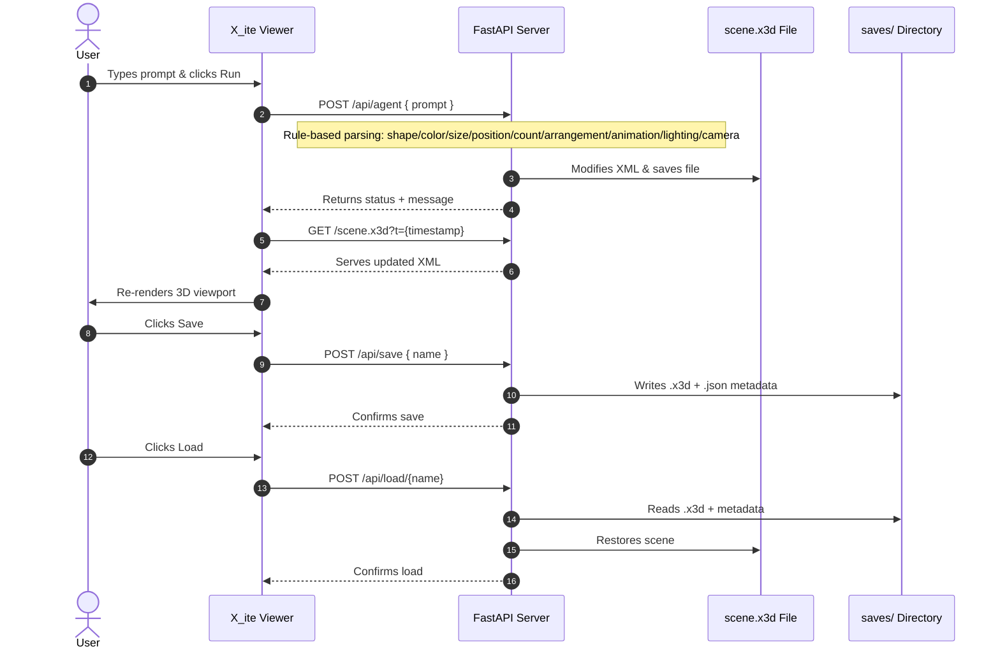

# X3D Agent — Enhanced

A rule-based natural language interface for building and exploring X3D 3D scenes in the browser, powered by FastAPI + X_ite.

## Installation

```bash
pip install fastapi uvicorn pydantic
uvicorn app:app --host 0.0.0.0 --port 8000 --reload
```

---

## Architecture



---

## Endpoints

| Method | Path | Description |
|--------|------|-------------|
| `GET`  | `/` | Serves the HTML viewer UI |
| `GET`  | `/scene.x3d` | Serves the current X3D scene file |
| `POST` | `/api/agent` | Accepts `{ prompt }` and mutates the scene |
| `POST` | `/api/clear` | Resets scene to default |
| `GET`  | `/api/inspect` | Returns JSON list of objects in the scene |
| `POST` | `/api/save` | Saves current scene as `{ name }` |
| `POST` | `/api/load/{name}` | Loads a saved scene by name |
| `GET`  | `/api/saves` | Lists all saved scene names |

---

## What You Can Say

### Shapes (single)
```
place a red sphere to the left
spawn a huge gold torus in the center
create a tiny cyan cube floating
drop a purple cone to the right
add a silver capsule on the left
spawn a jade dodecahedron in the middle
place a gold cross in the center
add a cyan crescent above
spawn a neon blue torus knot
make a neon green icosahedron
place a gold star overhead
add a rose gold spiral up high
drop a tilted orange arrow in front
put a white plane below
```

### Multi-Shape Commands
```
add 5 red spheres in a row
spawn 8 blue cubes in a circle
create 6 gold stars in a grid
place 4 cyan cones scattered
```
Supported arrangements: **row**, **circle**, **grid**, **random/scattered**
Count: 2–20 (numbers or words like "five", "ten")

### Lighting
```
day / daytime / daylight / sunny
night / nighttime / night mode / dark mode
sunrise / dawn / golden hour / warm light
neon / neon lights / club / disco / rave
brighter / more light / brighten
dimmer / less light / dim / darker
add spotlight / add a light
```

### Camera / Viewpoints
```
reset camera / reset view / default view
top view / bird's eye / look down
front view / look from front
side view / profile view
isometric / iso view / 3/4 view
```

### Animation (applied to last added object)
```
spin / rotate / make it spin
bounce / bob / float up and down
pulse / breathe / grow and shrink
stop / freeze / stop animation
```

### Scene Inspection
```
what's in the scene?
list objects
inventory
how many objects?
describe scene
```

### Archive Import (from web3d.org)
```
load hello
load fog
load text
```

### Scene Management
```
undo / remove last
clear / reset / new scene
```

---

## New Shapes vs Original

| Shape | Aliases |
|-------|---------|
| capsule | pill, lozenge |
| dodecahedron | d12 |
| cross | plus, crucifix, crosshair |
| crescent | moon crescent |
| torus knot | knot, pretzel |

---

## UI Tabs

- **Console** — command log, auto-focuses after each run
- **Chips** — grouped quick-commands by category (Shapes, Multi, Animation, Lighting, Camera, Archive, Scene)
- **Saves** — named save/load with persistent `.x3d` files in `saves/`

---

## Notes

- Scene parsing is **rule-based regex** — no LLM or AI framework
- Object registry tracks in-memory state for inspection and undo
- `saves/` directory persists named scenes as `.x3d` + `.json` metadata
- Archive import fetches live from `web3d.org` (requires internet)
- X3D rendered via [X_ite](https://create3000.github.io/x_ite/) browser library
- Supports: hex colors (`#ff6600`), RGB (`color 1.0 0 0`), 60+ named colors, two-word combos (`rose gold`, `neon green`)
